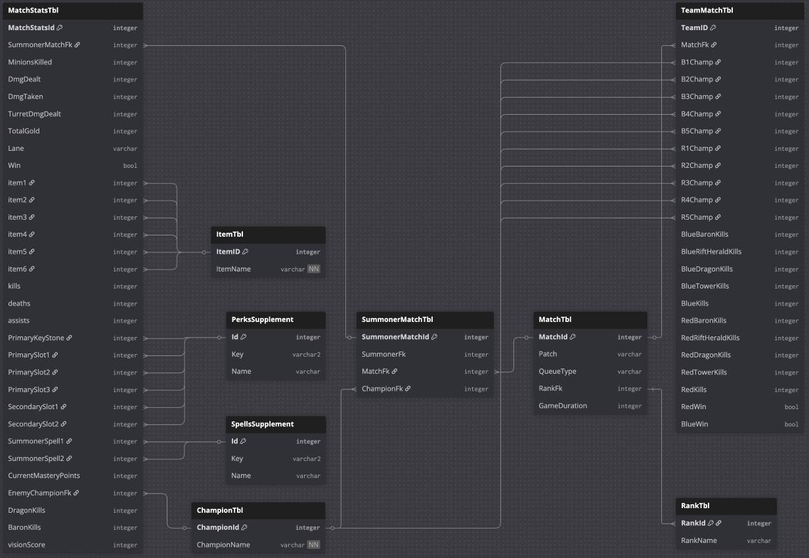

# League of Legends Match History & Summoner Data

## Source

* Kaggle:
  * ChampionTbl, ItemTbl, MatchStatsTbl, MatchTbl, RankTbl, SummonerMatchTbl, TeamMatchTbl:
    * **Title**: LoL Match History and Summoner Data (80k Matches)
    * **URL**: [https://www.kaggle.com/datasets/nathansmallcalder/lol-match-history-and-summoner-data-80k-matches](https://www.kaggle.com/datasets/nathansmallcalder/lol-match-history-and-summoner-data-80k-matches)
    * **Author**: Nathan Smallcalder
* DarkIntaqt:
  * SpellsSupplement:
    * **Title**: A list of Summoner Spell IDs for League of Legends
    * **URL**: https://darkintaqt.com/blog/summoner-ids
    * **Author**: DarkIntaqt
  * PerksSupplement:
    * **Title**: Rune ID lists - All perk IDs
    * **URL**: https://darkintaqt.com/blog/perk-ids
    * **Author**: DarkIntaqt
  * ItemSupplement: 
    * **Title**: A list of Item IDs for League of Legends
    * **URL**: https://darkintaqt.com/blog/item-ids
    * **Author**: DarkIntaqt

## Description

This dataset contains historical League of Legends match data and associated summoner information. It includes approximately 80,000 matches with detailed metadata suitable for data analysis, visualization, and machine learning tasks. The raw data is downloaded from Kaggle and stored locally for reproducibility and offline access. Additional supplementary data (`data/raw/*Supplement.csv`) comes from DarkIntaqt's blog.

The source data is in form of a relational database.



## Contents

```
data/
├── raw/
│   ├── ChampionsTbl.csv
│   ├── ItemTbl.csv
│   └── ...
├── processed/
└── README.md
```

## How to obtain the data

The data can be re-downloaded using KaggleHub:

```python
from kagglehub import dataset_download
import shutil
from pathlib import Path

src = Path(dataset_download(
    "nathansmallcalder/lol-match-history-and-summoner-data-80k-matches"
))
dst = Path("data/raw/lol-match-history")

shutil.copytree(src, dst, dirs_exist_ok=True)
```

## Versioning

* Downloaded from Kaggle on: 2025-12-26
* Dataset version: as provided by Kaggle at download time.

## Licensing / Usage

Please refer to the Kaggle dataset page for licensing and usage restrictions.
This data is not redistributed in this repository.

## Notes

* Raw data should not be modified.
* Any cleaning or feature engineering should be saved in `data/processed/`.
